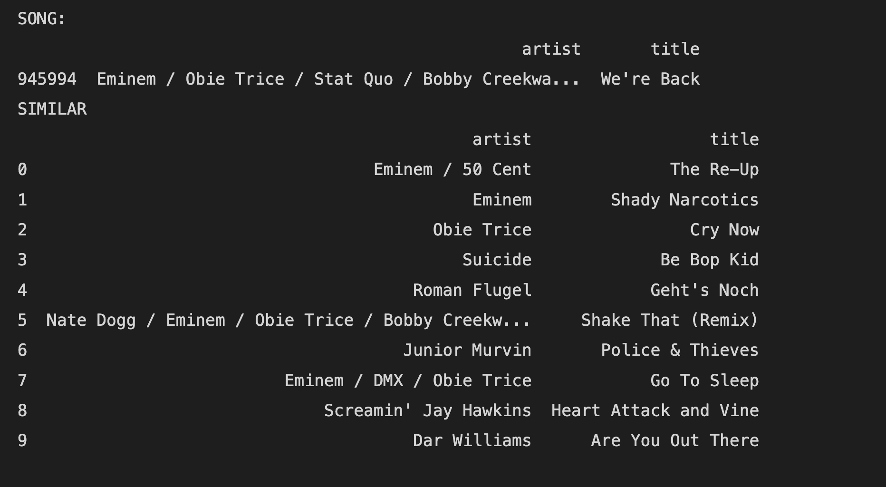

# MyStotify
Music recommender system. Features of MySpotify:
- **Top-250 Tracks:** A non-personalized approach.
- **Top-100 Tracks by Genre:** Includes genres such as Rock, Rap, Jazz, Electronic, Pop, Blues, Country, Reggae, and New Age. Non-personalized approach.
- **Collections:** Thematic collections of 50 songs each about love, war, happiness, loneliness, and money. Content-based approach.
- **People Similar to You Listen To:** 10 personalized recommendations for each user. Based on collaborative filtering.
- **People Who Listen to This Track Also Listen To:** 10 recommendations related to each track. Based on collaborative filtering.

## Dataset
The dataset can be found in [data.zip](). Please unzip it before running any program. The data is part of the [Million Songs Dataset (MSD)](http://millionsongdataset.com). The following components were used:

- **Mapping Between Track IDs and Song IDs:** `p02_unique_tracks.txt`
  - A list of unique tracks with track_id, song_id, artist, and title. 1,000,000 tracks were used.
- **The Echo Nest Taste Profile Subset:** `p02_train_triplets.txt.zip`
  - The format includes (user_id, song_id, play_count) triplets.
- **The musiXmatch Dataset:** `p02_mxm_dataset_train.txt.zip`
  - It contains track_id, mxm_track_id, followed by word count for each of the top words, comma-separated.
- **Tagtraum Genre Annotations for the Million Song Dataset:** `p02_msd_tagtraum_cd2.cls`
  - This file contains three fields: track_id, majority_genre, minority_genre.
- **Labeled Songs:** `lastfm_tags.db`
  - List of track_id with short descriptive tags, e.g., *"money friend burro banton"*. Used in target label for collection classification.

## Models and Usage

### Non-personalized Approach
Implemented in `MySpotify.ipynb`, see the outputs in **Top-250 Tracks** and **Top-100 Tracks by Genre** sections.

### Collections
Returns 50 tracks based on a given keyword (love, war, happiness, loneliness, money) with the following fields: index number, artist name, track title, and play count. The list is sorted by play count in descending order.

Different approaches to these recommendations:
- **Baseline:** Uses word counts in songs.
- **Word2Vec:** Utilizes similar tokens of the keyword found by Word2Vec.
- **Classification:** Classifies tracks with a KNN model by words in songs. The `lastfm_tags` dataset was used for target labels during the train.

For research and output results of classification, see in `MySpotify.ipynb`.
To receive a collection by keyword, use `myspotify.py` with `--recommend/-r category` and `--parameter/-p` with one of the keywords `[love|war|happiness|loneliness|money]`. Remember to unzip `data.zip` before running.

Example:
```bash
python3 myspotify.py -r category -p money
```
## Models and Usage:

### Non-personalized approach.
These options are made in MySpotify.ipynb file, see **Top-250 tracks** and **Top-100 tracks by genre** chaters outputs. 

### People similar to you listen

This option provides 10 new track recommendations per user. For training purposes, the user-item dataset was split into train and test. The used metric is p@k (precision at k), which checks how many of the 10 recommended items were correct.
The model is based on a collaborative filtering approach.
To see the training research, refer to `MySpotify.ipynb.`
To run the train model use `-r byuser` option and `-p [user_id]`.

Example

```bash
python3 myspotify.py -r byuser -p 'ec6dfcf19485cb011e0b22637075037aae34cf26'
```
You will receive 10 recommended tracks in 'likelihood' order.

### People who listen to this track usually listen
Recommend 10 tracks based on song ID using the same technique, but the collaborative filtering is item-based.

Example for running:

```bash
python3 myspotify.py -r bysong -p 'SOUHHHH12AF729E4AF'
```

The result

 

### Bonuses
Additional features of MySpotify:

- **Top Listened by Artist:** Recommends new tracks for the user, based on the top songs of an artist they have already listened to.
- **Genre and Tag:** Users can combine genre and tag to see 10 recommendations.
- **250 Least Popular Songs:** Discover unheard tracks. Be the first to listen to these songs!


